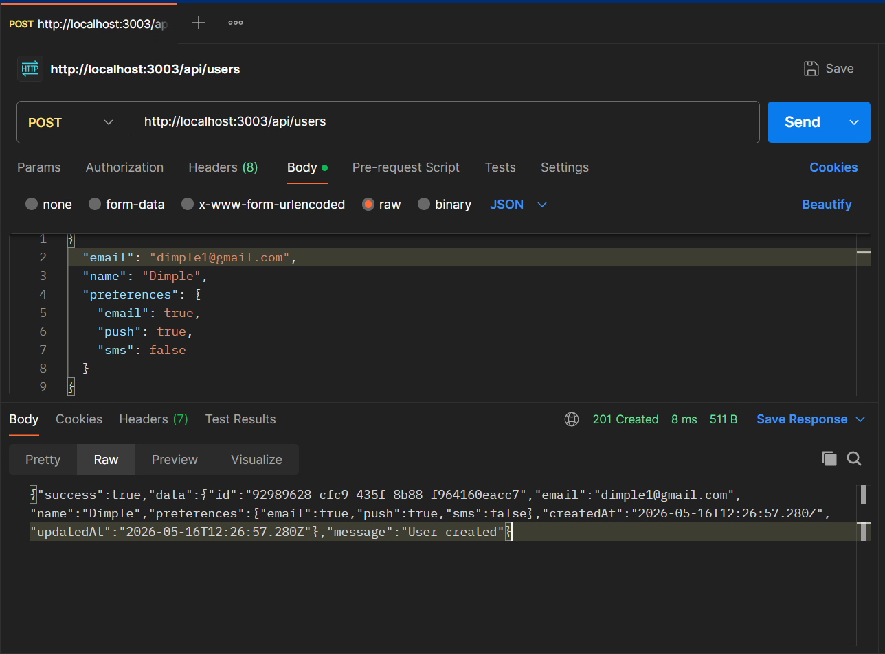
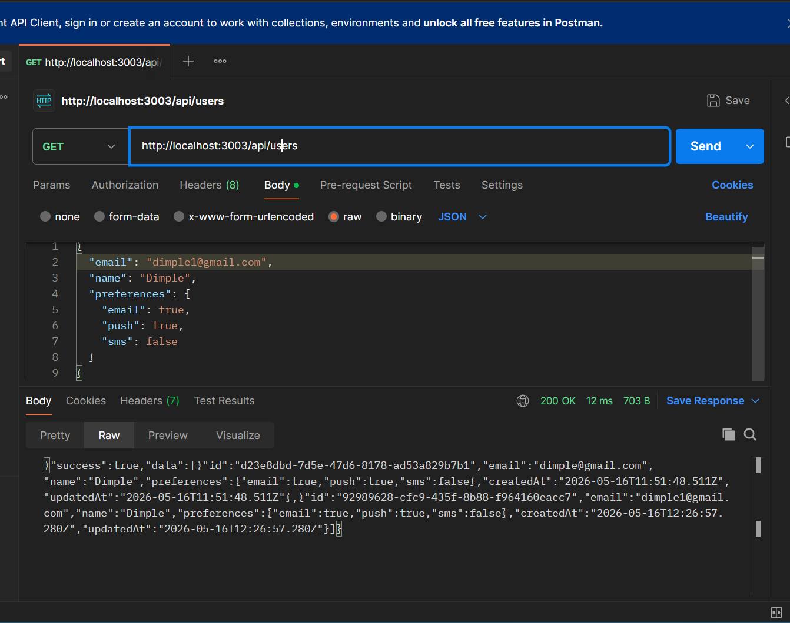
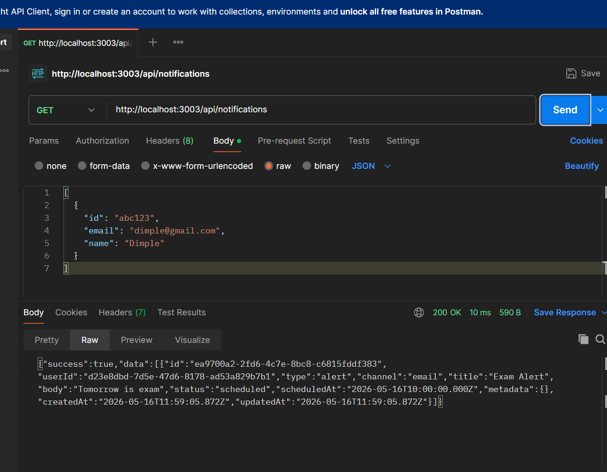
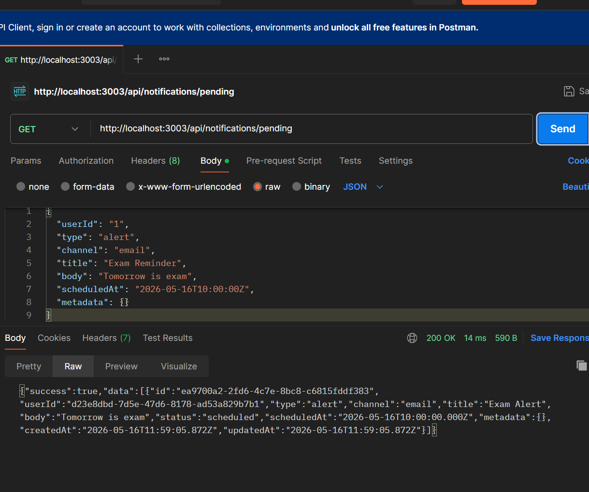
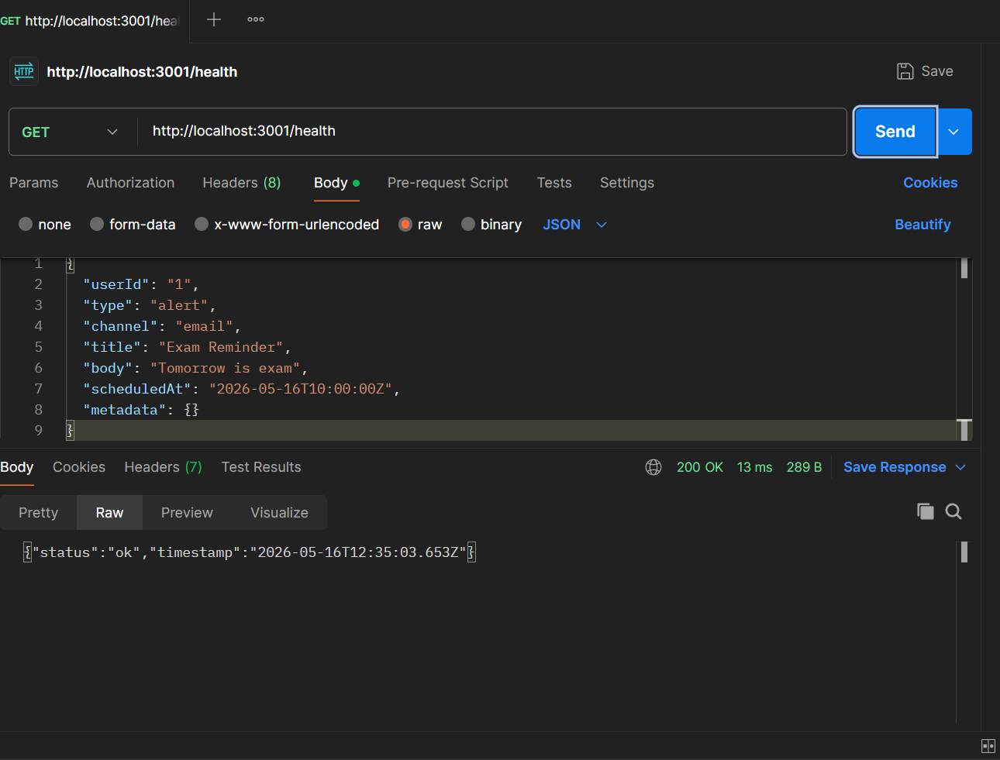
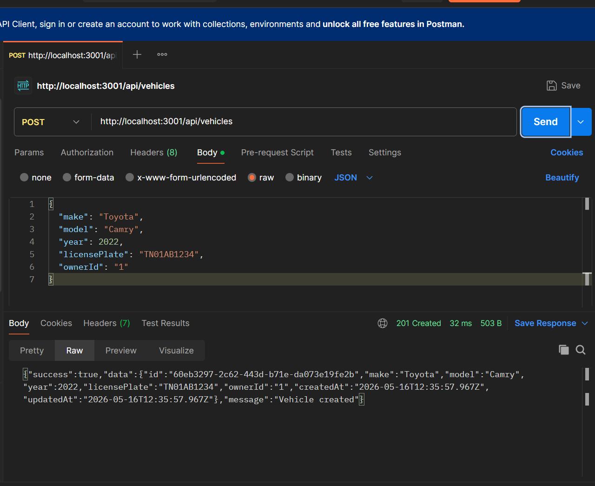
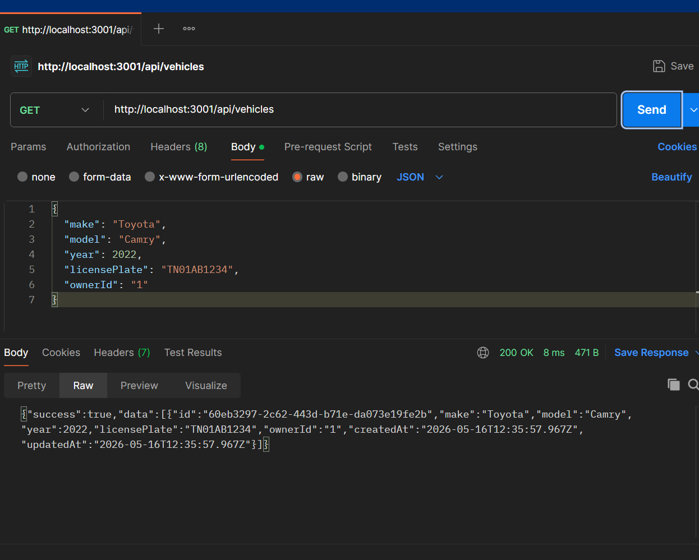
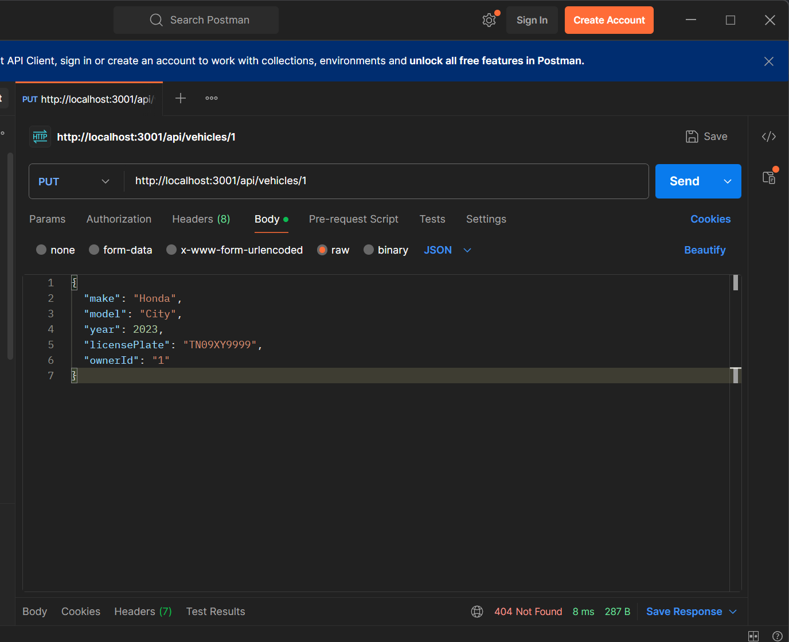
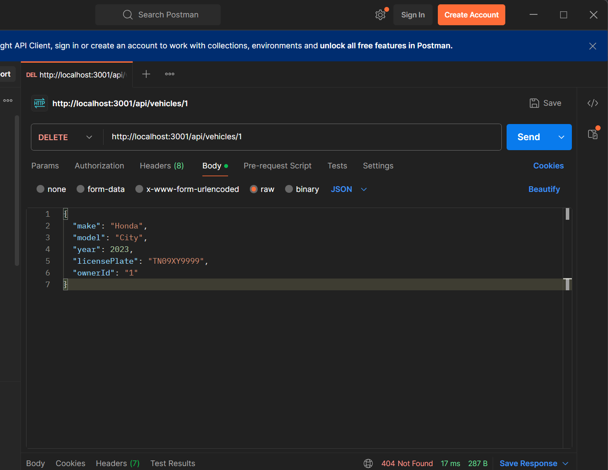

# Backend Assessment - 22MIS7161

Backend REST API assessment demonstrating Node.js + Express + TypeScript development.

## Repository Structure

```
22MIS7161/
├── logging_middleware/      # Reusable logging package
├── vehicle_maintence_scheduler/  # Vehicle maintenance REST API
├── notification_app_be/     # Notification system REST API
├── notification_system_design.md  # System design document
└── README.md
```

## Tech Stack

- Node.js + Express
- TypeScript
- pnpm

## Setup

Each project has its own README with setup instructions.

```bash
cd <project_folder>
pnpm install
pnpm dev
```
## output
GET-http://localhost:3003/health

POST-http://localhost:3003/api/users

GET-http://localhost:3003/api/users

GET:http://localhost:3003/api/notifications

POST-http://localhost:3003/api/notifications
GET-http://localhost:3003/api/notifications/pending

GET-http://localhost:3001/health

POST:http://localhost:3001/api/vehicles

get:http://localhost:3001/api/vehicles

put:http://localhost:3001/api/vehicles/1

delete:ut:http://localhost:3001/api/vehicles/1

